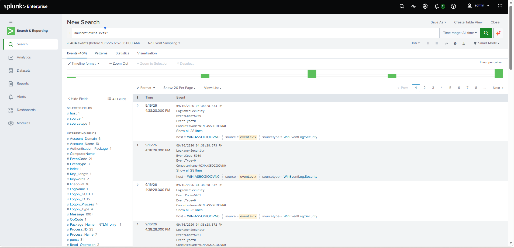
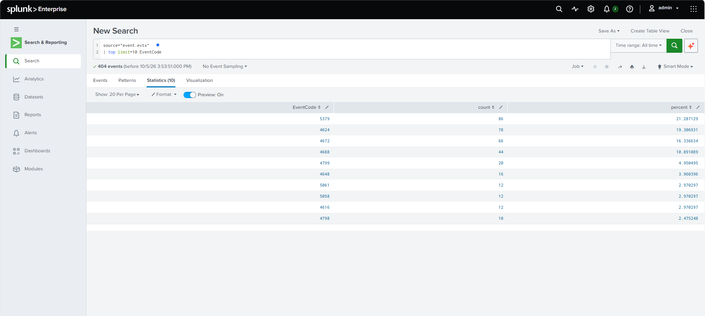
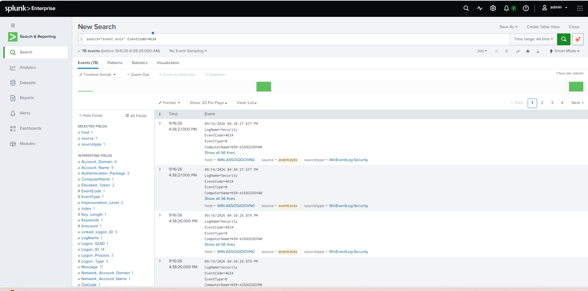
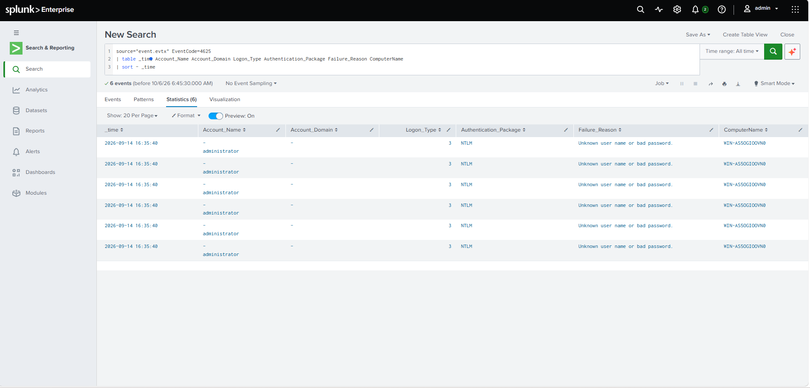
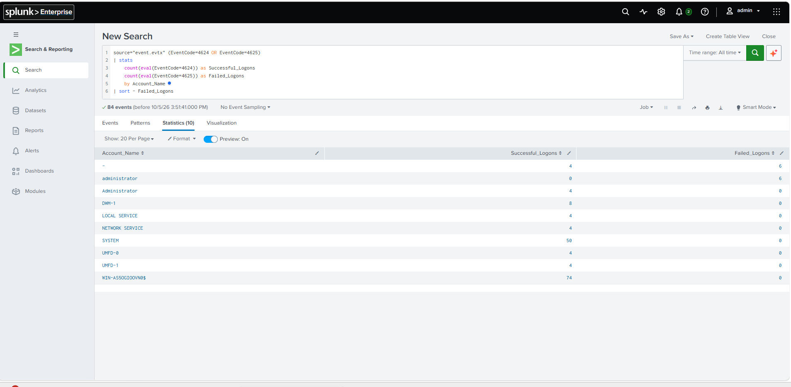
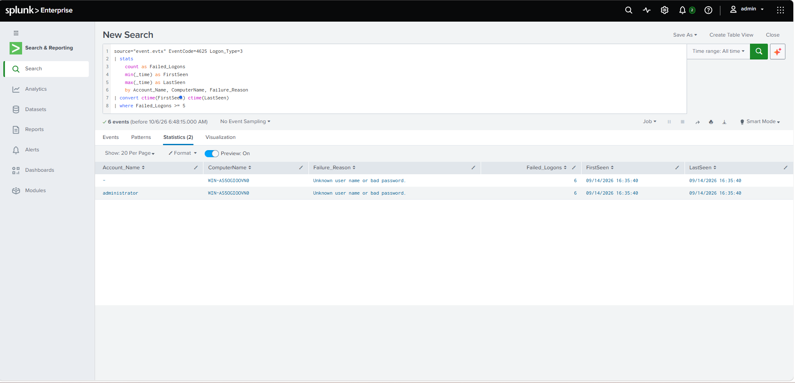
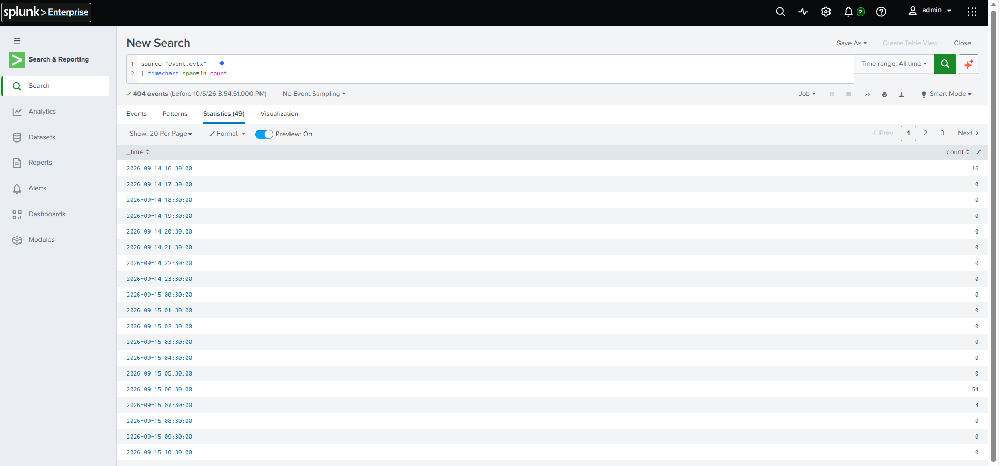
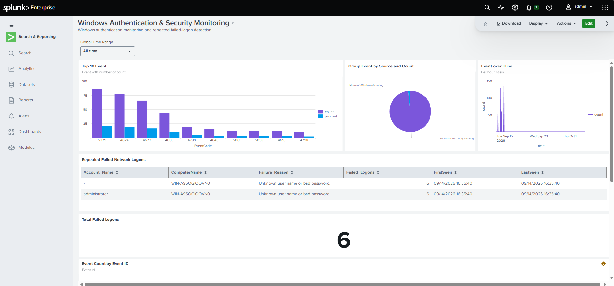

# Splunk Windows Authentication & Security Monitoring Lab

## Project Overview

This project demonstrates a hands-on SOC monitoring and detection engineering lab using Splunk Enterprise and Windows Security Event Logs.

The objective was to practice Windows authentication monitoring, SPL query development, security event investigation, detection engineering, event correlation, and SOC dashboard creation.

A Windows Security EVTX file was ingested into Splunk and analyzed to identify successful and failed authentication activity.

The investigation focused particularly on Windows Event IDs 4624 and 4625 and resulted in the development of a threshold-based detection for repeated failed Windows network logons.

---

## Lab Architecture

```text
Windows Server Security Events
            |
            v
        EVTX File
            |
            v
      Splunk Enterprise
            |
            v
       SPL Queries
            |
            +----------------------+
            |                      |
            v                      v
 Successful Logons          Failed Logons
 Event ID 4624              Event ID 4625
            |                      |
            +----------+-----------+
                       |
                       v
            Authentication Analysis
                       |
                       v
         Repeated Failed Logon Detection
                       |
                       v
              SOC Monitoring Dashboard
```

---

## Technologies & Skills

- Splunk Enterprise
- Splunk Search Processing Language (SPL)
- Windows Security Event Logs
- Windows Event ID analysis
- Authentication monitoring
- SOC monitoring
- SIEM
- Detection engineering
- Security event correlation
- Failed-logon analysis
- Dashboard development
- Windows Server security monitoring

---

# 1. Windows Security Event Log Ingestion


Windows Security Event Log data was imported into Splunk from an EVTX file.

The dataset was validated using:

```spl
source="event.evtx"
```

The imported dataset contained Windows Security auditing events that could be analyzed using SPL.

The dataset included fields such as:

- Account Name
- Account Domain
- Authentication Package
- Computer Name
- Event Code
- Logon ID
- Logon Process
- Logon Type

---

# 2. Windows Event Analysis


The most frequently occurring Windows Security Event IDs were identified using:

```spl
source="event.evtx"
| top limit=10 EventCode
```

This provided an overview of the Windows security activity contained within the dataset.

Examples of observed security event types included authentication events, privileged logon activity, process creation events, and other Windows Security auditing events.

---

# 3. Successful Windows Logon Analysis


Windows Event ID 4624 was investigated to identify successful authentication activity.

```spl
source="event.evtx" EventCode=4624
```

The dataset contained multiple successful logon events associated with system, service, machine, and administrator accounts.

This analysis established a baseline for successful authentication activity that could later be compared with failed authentication attempts.

---

# 4. Failed Windows Logon Investigation


Windows Event ID 4625 was analyzed to investigate failed authentication attempts.

```spl
source="event.evtx" EventCode=4625
```

The investigation identified six failed authentication events.

A more detailed SPL query was used to analyze the authentication context:

```spl
source="event.evtx" EventCode=4625
| table
    _time
    Account_Name
    Account_Domain
    Logon_Type
    Authentication_Package
    Failure_Reason
    ComputerName
| sort - _time
```

The analysis identified:

```text
Failed Logons: 6
Logon Type: 3
Authentication Package: NTLM
Failure Reason: Unknown user name or bad password
```

The events were associated with repeated failed network authentication attempts against the Windows lab system.

---

# 5. Failed Logons by Account

The failed authentication events were grouped by account using SPL.

```spl
source="event.evtx" EventCode=4625
| stats count as Failed_Logons by Account_Name
| sort - Failed_Logons
```

This query helped identify which account was associated with repeated authentication failures.

The investigation identified six failed logon events associated with the administrator account representation in the imported dataset.

---

# 6. Successful vs Failed Authentication Correlation


Successful and failed authentication activity was correlated using Windows Event IDs 4624 and 4625.

```spl
source="event.evtx" (EventCode=4624 OR EventCode=4625)
| stats
    count(eval(EventCode=4624)) as Successful_Logons
    count(eval(EventCode=4625)) as Failed_Logons
    by Account_Name
| sort - Failed_Logons
```

This query provided visibility into authentication behavior across multiple accounts.

The correlation allowed successful and unsuccessful authentication activity to be compared within a single investigation view.

---

# 7. Repeated Failed Network Logon Detection


A threshold-based SPL detection was developed to identify repeated failed Windows network logons.

```spl
source="event.evtx" EventCode=4625 Logon_Type=3
| stats
    count as Failed_Logons
    min(_time) as FirstSeen
    max(_time) as LastSeen
    by Account_Name, ComputerName, Failure_Reason
| convert ctime(FirstSeen) ctime(LastSeen)
| where Failed_Logons >= 5
```

### Detection Logic

The detection identifies:

```text
Windows Event ID 4625
        |
        v
Failed Authentication
        |
        v
Logon Type 3
(Network Logon)
        |
        v
Group by Account and Host
        |
        v
Failed Logons >= 5
        |
        v
Flag for SOC Investigation
```

### Detection Result

The detection identified:

```text
Failed Logons: 6
Failure Reason: Unknown user name or bad password
Logon Type: Network
```

This activity was flagged for analyst investigation.

The detection is intentionally described as **Repeated Failed Windows Network Logons** rather than a confirmed brute-force attack because the available evidence demonstrates repeated failed authentication attempts but does not independently establish attacker intent.

---

# 8. Security Activity Over Time


Windows Security Event activity was visualized over time using:

```spl
source="event.evtx"
| timechart span=1h count
```

This visualization helped identify periods with increased Windows Security Event activity.

Time-based analysis is useful during SOC investigations because analysts can identify activity spikes and pivot into the corresponding events.

---

# 9. Windows Authentication & Security Monitoring Dashboard


A custom Splunk dashboard was created to centralize Windows security monitoring.

### Dashboard

**Windows Authentication & Security Monitoring**

The dashboard contains:

- Top Windows Security Event IDs
- Event source distribution
- Windows Security Event activity over time
- Repeated failed network logon detection
- Total failed logon count
- Authentication investigation context

### Total Failed Logons

A Single Value visualization was created using:

```spl
source="event.evtx" EventCode=4625
| stats count as Failed_Logons
```

The dashboard identified:

```text
Total Failed Logons: 6
```

### Repeated Failed Network Logons

The detailed detection panel displays:

- Account Name
- Computer Name
- Failure Reason
- Failed Logon Count
- First Seen
- Last Seen

This provides SOC analysts with both high-level security monitoring and detailed authentication investigation context.

---

# 10. Alerting Limitation

The threshold-based SPL detection was designed to identify five or more failed Windows network logons associated with the same account and host.

The detection successfully identified six failed network logons in the lab dataset.

The lab is running Splunk Free. Scheduled alerting is not available in the current lab edition, so the detection was validated using SPL search results and incorporated into the Windows Authentication & Security Monitoring dashboard.

In a Splunk Enterprise environment with alerting capabilities, this detection could be operationalized as a scheduled alert that triggers when the search returns one or more results.

---

# 11. Investigation Findings

The authentication investigation identified the following observations:

```text
Windows Event ID: 4625
Failed Authentication Events: 6
Logon Type: 3 (Network)
Authentication Package: NTLM
Failure Reason: Unknown user name or bad password
```

The activity met the lab detection threshold of five or more failed network authentication attempts.

The available evidence supports classifying the activity as **repeated failed network logons requiring investigation**.

The evidence alone was not considered sufficient to classify the activity as a confirmed brute-force attack.

---

# 12. Detection Engineering Approach

The project demonstrates the progression from raw security telemetry to an operational SOC detection.

```text
Raw Windows Security Events
            |
            v
       SPL Analysis
            |
            v
   Authentication Investigation
            |
            v
 Successful / Failed Correlation
            |
            v
 Threshold-Based Detection
            |
            v
      SOC Dashboard
            |
            v
      Analyst Investigation
```

This workflow demonstrates how security telemetry can be transformed into actionable detection logic.

---

# 13. Key Skills Demonstrated

## Splunk

- SPL query development
- Event searching
- Statistical analysis
- Event correlation
- Time-based analysis
- Dashboard development
- Security visualization

## Windows Security

- Windows Security Event Logs
- Event ID 4624 analysis
- Event ID 4625 analysis
- Authentication monitoring
- Logon Type analysis
- NTLM authentication analysis
- Failed-login investigation

## SOC Operations

- Security-event triage
- Authentication investigation
- Detection engineering
- Threshold-based detection
- Event correlation
- Timeline analysis
- Dashboard-based monitoring
- Evidence-based analyst conclusions

---

# 14. Project Evidence

Screenshots in this repository demonstrate:

1. Failed Windows logon investigation
2. Successful vs failed authentication correlation
3. Detailed Event ID 4625 analysis
4. Repeated failed network logon detection
5. Windows Security Event activity over time
6. Windows Authentication & Security Monitoring dashboard

---

## Project Outcome

This project provided hands-on experience investigating Windows authentication telemetry using Splunk.

The completed workflow demonstrates:

```text
Windows Security Logs
        |
        v
Splunk Ingestion
        |
        v
SPL Investigation
        |
        v
Authentication Correlation
        |
        v
Repeated Failed Logon Detection
        |
        v
Security Visualization
        |
        v
SOC Dashboard
```

The project strengthened practical skills relevant to:

- SOC Analyst
- Junior Security Analyst
- SIEM Analyst
- Cybersecurity Analyst

---

## Disclaimer

This project was completed in a controlled cybersecurity lab environment for learning and portfolio development.

The Windows event data was analyzed for defensive security monitoring and SOC investigation practice. The project does not claim that the observed failed authentication events represent a confirmed malicious attack without sufficient supporting evidence.
